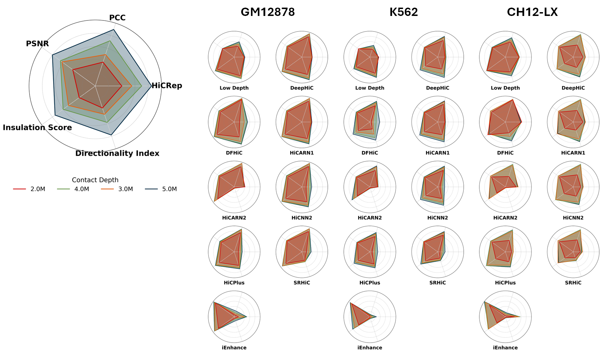
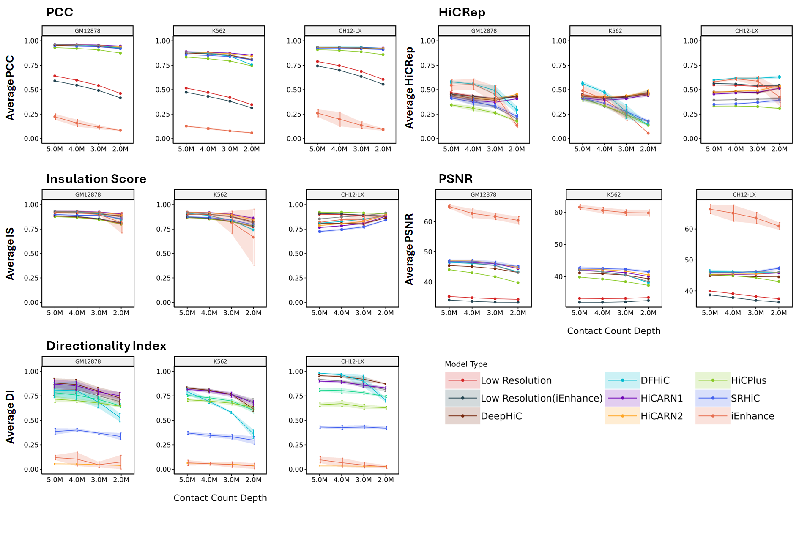
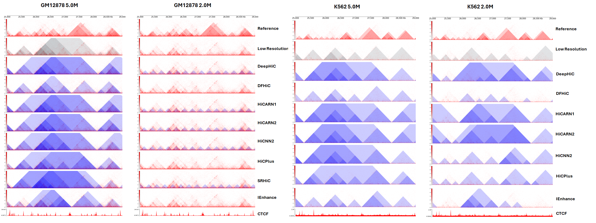
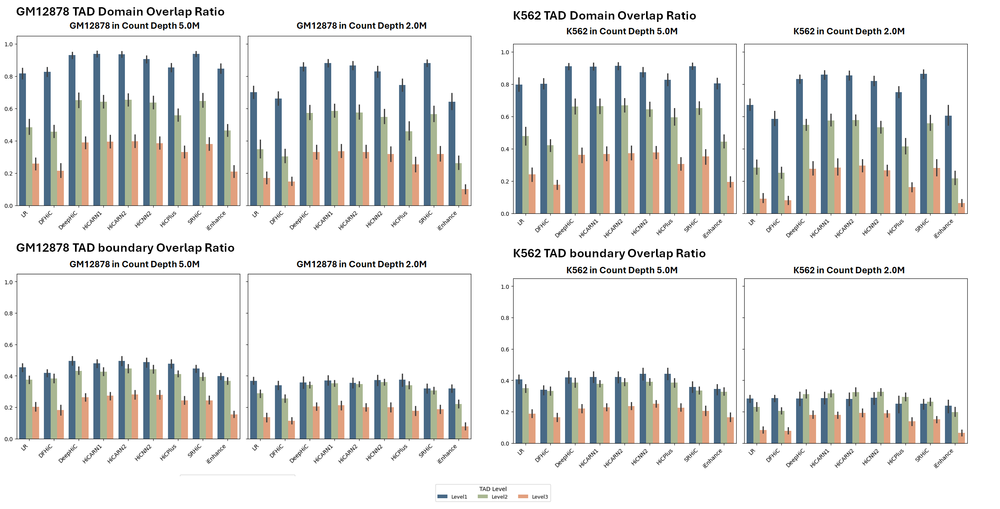
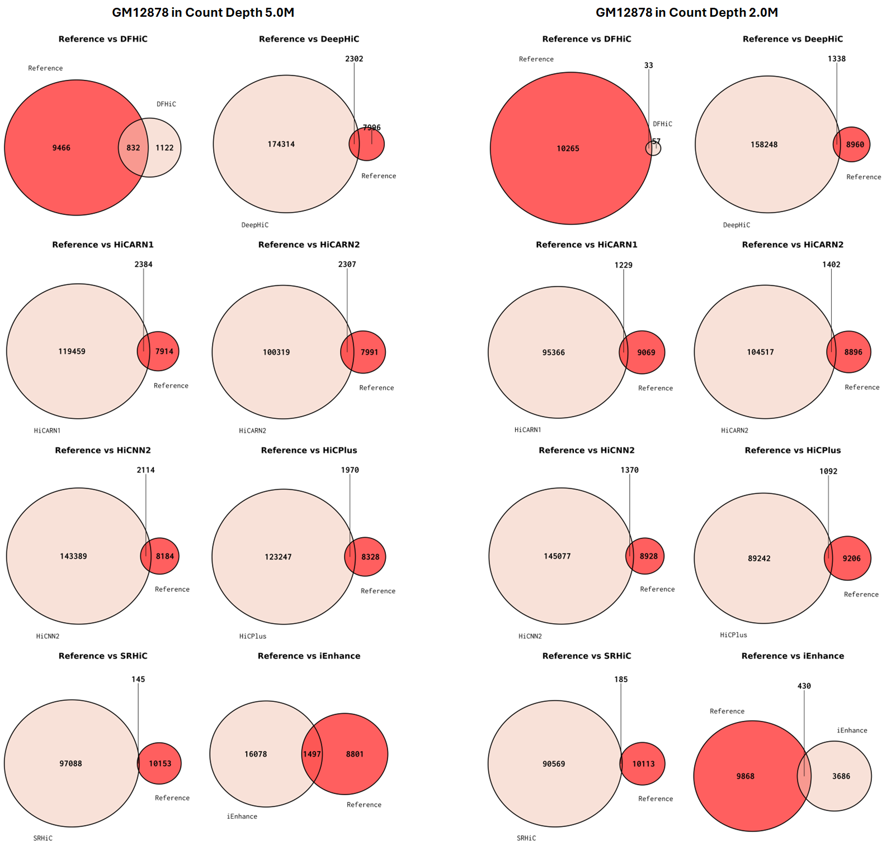
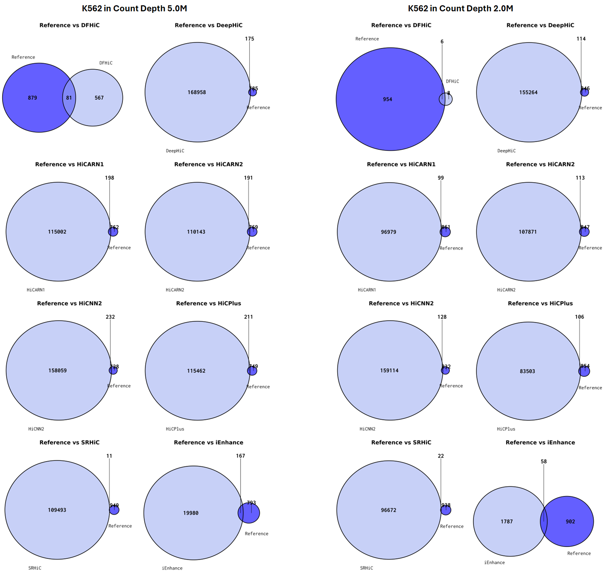

# Hi-C Enhancement Analysis and Biological Benchmarking Framework

This repository provides a downstream analysis and benchmarking framework to evaluate whether Hi-C contact maps reconstructed by deep learning–based Hi-C enhancement models are biologically meaningful. Rather than proposing or training new enhancement models, this work focuses on systematic, quantitative, and biologically grounded evaluation of model-enhanced Hi-C data across multiple cell lines, resolutions, and downsampling levels.

## Overview
Deep learning–based Hi-C enhancement models aim to recover high-resolution chromatin contact maps from downsampled bulk Hi-C data. While many studies demonstrate visual improvements in enhanced Hi-C maps, comprehensive and quantitative assessments of their biological validity remain limited.

In this study, we evaluate whether enhanced Hi-C contact maps preserve biologically meaningful chromatin features by comparing original, downsampled, and model-enhanced Hi-C data using loop- and domain-level metrics.

## Data provenance
This repository focuses on **downstream analysis, evaluation, and visualization*  of Hi-C data enhanced by deep learning–based Hi-C enhancement models.

- Data generation, preprocessing, and model training were performed using
  the HiHiC framework:
  https://github.com/jkrLab/HiHiC
- This repository does **not** reproduce data generation or model training.

## Analysis Design
For each experiment, we compared three types of Hi-C contact maps:

1. Original high-depth bulk Hi-C data
2. Downsampled low-depth bulk Hi-C data
3. Hi-C maps enhanced by deep learning–based super-resolution models

Analyses were conducted across:
- Multiple cell lines (e.g. GM12878, K562, CH12-LX)
- Multiple downsampling depths (e.g. 5M,4M,3M,2M)
- Multiple enhancement models (e.g. DFHiC, DeepHiC, HiCARN1, HiCARN2, HiCNN2, HiCPlust, SRHiC, iEnhance)

## Evaluation Strategy
Biological usefulness was assessed using quantitative and biologically interpretable metrics, rather than visual similarity alone.

### Quantitative Metrics

- Peak Signal-to-Noise Ratio (PSNR)
- HiCRep correlation
- Directionality Index
- Insulation Score
- Pearson Correlation Coefficient
  
### Biological Feature Recovery
- **Topologically Associating Domains (TADs)**
  - TAD hierarchy comparison
  - Domain overlap ratio
  - Boundary overlap ratio
  - TopDom-based evaluation
 
- **Chromatin Loops**
  - Loop detection using Mustache
  - Overlap with reference loops

 ---

## Results

### Overall quantitative performance across sequencing depths
We first assessed the overall performance of Hi-C enhancement models using five quantitative metrics: PSNR, HiCRep, Pearson correlation coefficient (PCC),
Directionality Index, and Insulation Score.

Radar plots summarize the relative performance of each model across different contact count depths (5M, 4M, 3M, and 2M reads).

  

  

### Qualitative comparison of TAD structures
We performed a qualitative comparison of topologically associating
domain (TAD) structures using TopDom across original, downsampled,
and enhanced Hi-C contact maps.

The degree of TAD structure recovery varies across models and sequencing depths, indicating that enhancement performance is model-dependent.

  

  

### Reference loop recovery by enhanced Hi-C maps
To directly assess biological relevance at the finest structural scale,
we evaluated chromatin loop recovery using Mustache-based loop calling.
For each enhanced Hi-C dataset, detected loops were compared against
reference loops derived from the original high-depth Hi-C data.

Venn diagrams illustrate the overlap between reference loops and
loops detected from enhanced Hi-C maps under different sequencing depths
(5M and 2M reads).

  

  

